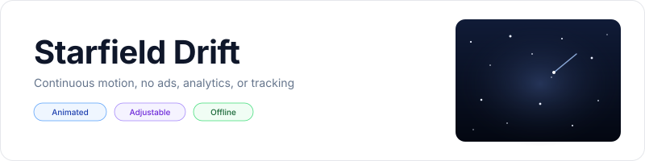
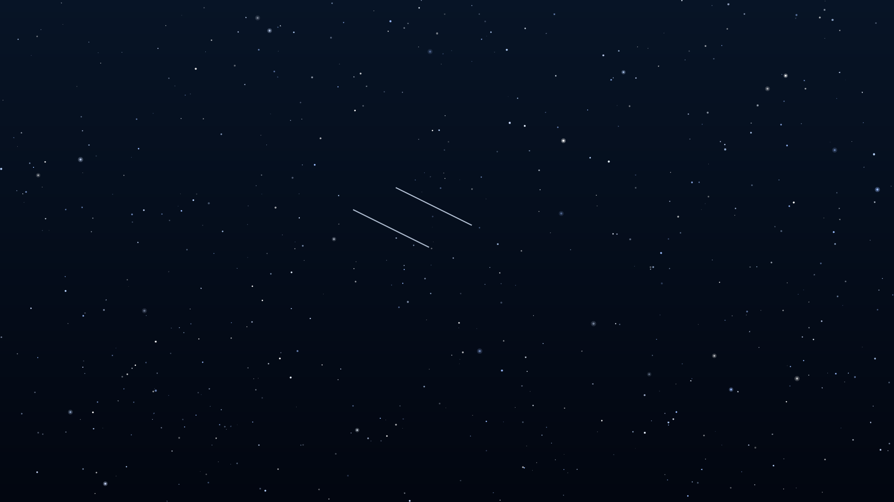
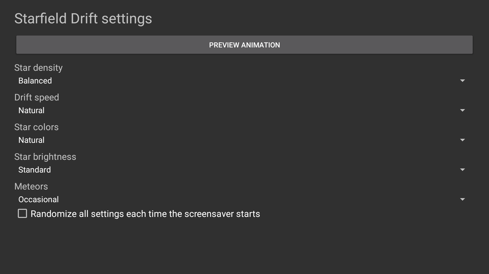

<p align="center">
    <picture>
        <source media="(prefers-color-scheme: dark)" srcset="art/banner-dark.svg">
        <source media="(prefers-color-scheme: light)" srcset="art/banner-light.svg">
        
    </picture>
</p>

<p align="center">A continuously moving starfield screensaver for Fire TV, Android TV, and Google TV.</p>

<p align="center">
    <a href="https://github.com/jeremykenedy/starfield-drift/releases"></a>
    <a href="https://github.com/jeremykenedy/starfield-drift/releases"></a>
    <a href="https://github.com/jeremykenedy/starfield-drift/actions/workflows/ci.yml"></a>
    <a href="https://github.com/jeremykenedy/starfield-drift/actions/workflows/style.yml"></a>
    <a href="https://github.com/jeremykenedy/starfield-drift/actions/workflows/docs.yml"></a>
    <a href="https://github.com/jeremykenedy/starfield-drift/actions/workflows/security.yml"></a>
    <a href="LICENSE"></a>
    <a href="https://github.com/jeremykenedy"></a>
    <a href="https://github.com/jeremykenedy/starfield-drift" title="Open the repository and click Star"></a>
    <a href="https://github.com/jeremykenedy/starfield-drift/stargazers"></a>
    <a href="https://github.com/sponsors/jeremykenedy"></a>
</p>

Show some love by starring this repository on GitHub.

## Table of contents

- [Privacy](#privacy)
- [Features](#features)
- [Requirements](#requirements)
- [Installation](#installation)
- [Configuration](#configuration)
- [Screenshots](#screenshots)
- [Building and testing](#building-and-testing)
- [Documentation](#documentation)
- [Release notes](#release-notes)
- [License](#license)

## Privacy

The Android app requests no network permission and makes no network requests. It contains no ads, analytics, telemetry, crash reporting, tracking, or reporting code. Preferences stay on the device. The standalone installer contacts GitHub only when you ask it to fetch a release APK and checksum. That request does not include TV, device, or usage data.

## Features

- Animated stars move at different apparent depths and subtly vary in brightness.
- Natural, cool blue, and warm amber star palettes.
- Sparse, balanced, dense, and packed star counts.
- Slow, natural, and fast drift speeds.
- Dim, standard, and bright star luminance settings.
- Optional occasional or frequent meteor trails.
- Per-setting random selection and optional randomization of all settings at each start.
- Remote-friendly settings and a validated settings provider for host applications.
- Android DreamService that pauses animation when it is not visible.

## Requirements

- Android 6.0 (API 23) or newer with DreamService support.
- ADB for installation from a computer.
- Android SDK platform 36 and build-tools 36.0.0 for local builds.

Android TV emulator behavior has been checked at 1920x1080. Physical Fire TV and Google TV devices were not tested for this release. See [device verification](docs/VERIFICATION.md) for the test limits.

## Installation

Connect the TV to the same network as this computer, enable ADB debugging, and run:

```bash
python3 install.py --serial TV_IP:5555
```

The installer fetches the latest signed release from GitHub, verifies its published SHA-256 checksum, and installs or updates the app. Select Starfield Drift in the TV's screensaver or ambient display settings. See [installation and removal](docs/INSTALLATION.md) for local APK installation, unattended use, and uninstall.

## Configuration

Open Starfield Drift from the TV launcher to change settings. Each option supports its own random choice. The global random setting chooses new options when a screensaver session begins. Full defaults and values are in [configuration](docs/CONFIGURATION.md).

## Screenshots

<p align="center">
    
    
</p>

Captures come from the running app; device and setting details are recorded in [device verification](docs/VERIFICATION.md).

## Building and testing

```bash
bash build.sh
bash test.sh
bash scripts/test-python-coverage.sh
bash scripts/test-coverage.sh
```

The app has no third-party runtime dependencies. See [building](docs/BUILDING.md), [testing](docs/TESTING.md), and [architecture](docs/ARCHITECTURE.md).

## Documentation

- [Installation and removal](docs/INSTALLATION.md)
- [Configuration and host settings](docs/CONFIGURATION.md)
- [Building from source](docs/BUILDING.md)
- [Architecture](docs/ARCHITECTURE.md)
- [Testing and coverage](docs/TESTING.md)
- [Device verification](docs/VERIFICATION.md)
- [Continuous integration](docs/CI.md)
- [Troubleshooting](docs/TROUBLESHOOTING.md)
- [Release process](docs/RELEASING.md)

## Release notes

- [Version 1.0.0](docs/releases/v1.0.0.md)

## License

Starfield Drift is licensed under the [Apache License, Version 2.0](LICENSE). See [NOTICE](NOTICE) for project notices.
